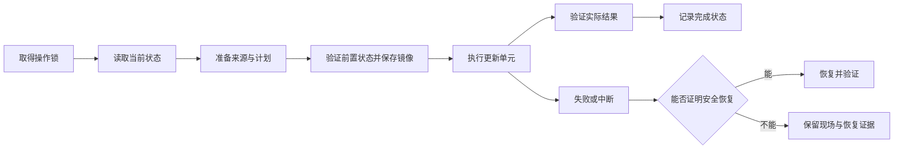

# 实现说明

skillctl 使用一个 Go 进程和本地 TOML/JSON 文件。既有 Provider 继续拥有安装与原生元数据，新安装由 skillctl 维护共享内容与 Agent 使用关系。

## 模块与状态

| 模块 | 职责 |
|---|---|
| `scan.go`、`hosts.go`、`host_plugins.go` | 物理扫描、用户/项目目录、原生插件安装记录与启用状态 |
| `inventory.go`、`catalog.go` | 来源身份、内容副本、bindings、能力、结构化诊断与共享存储目录 |
| `package_source.go`、`source_cache.go`、`source_session.go` | 来源解析、受限归档展开、Git/制品缓存、批量来源检查 |
| `provenance.go`、`install_history.go` | 合并权威证据，验证结构化安装记录；不按名称猜来源 |
| `lifecycle.go`、`manifest.go` | 生成安装/使用关系计划，固定版本，协调环境与 profile |
| `transaction.go`、`external_transactions.go`、`plugin_operations.go` | 文件事务、原 CLI 更新历史、插件整包操作及恢复 |
| `cli_manager.go`、`inspection_commands.go`、`report.go` | 命令路由、v1 兼容输出、v2 资产与结果 envelope |

本机状态位于 `SKILLCTL_HOME` 或系统用户配置目录下的 `skillctl`：

- `config.toml`：本机发现范围，仅 `config init` 显式初始化。
- `inventory.json`：共享内容版本、基线、所有 Agent 绑定及环境归属。
- `sources.json`：兼容既有复制安装来源与 Provider 基线。
- `store/<source-id>/<digest>/`：Agent 扫描目录外的内容版本。
- `disabled/`：原地目录停用时保留的快照。
- `hosts/`：已验证的宿主清单与观察基线。
- `profiles/`：本机激活 profile。
- `history/<UUID>/operation.json` 与 `before/`、`after/`：持久事务记录及镜像。

Git 来源缓存沿用系统用户缓存目录。项目中的 `skillctl.toml` / `skillctl.lock` 可共享，不包含本机绝对来源地址或 URL 凭据；本机 inventory/history 可以记录实际路径。

## 身份与发现

来源身份由 kind、来源地址、来源内路径和 ref 组成；目录副本另有 contentId。共享物理内容只描述一次，但保留每个 Agent/scope/project/path 的绑定。路径比较解析已存在的父目录别名，并保留叶子链接的独立身份，避免 macOS `/var` 别名以及多个 Agent 链接造成误合并。

无效 SKILL.md、不可读目录和断链保留为诊断项。v1 按原契约合并同名报告，同时保留 installations；v2 不按显示名称合并资产。

插件发现读取安装记录指定的版本，不从最大 cache 版本号推断安装状态。Codex 的本地列表可能使用上次原生查询的缓存，并明确标注；Claude 按 user/project/local 的安装和启用记录识别包。宿主未提供的操作通过 capabilities 显式拒绝。

## 执行与恢复

文件事务以真实修改路径为单位，拒绝重叠目标和包含事务日志的目标。每一步持久记录状态，执行前再次验证内容，使用同目录 stage/backup 和 rename 完成替换。事务指纹包含字节、模式与链接目标；来源内容摘要沿用跨平台文本换行规范化规则。回退前再次验证现场与备份，不覆盖后续编辑。

复制安装的更新将内容和来源记录放入同一事务。Git 原地更新记录整个仓库；linked worktree 另记录必要 gitdir 与分支引用。Vercel/well-known/GitHub CLI 仍执行原生更新，既有结果校验和失败恢复之外，新增持久 before/after 证据。外部命令被中断时，无法确定来源的新字节不会被当成可自动回滚的状态。

插件通过宿主接口执行和验证，不用文件覆盖改变宿主管理权。启停支持原生逆操作；没有精确版本恢复接口的更新/移除会报告回退不支持。已安装状态或 CLI 受理本身不足以代表验证完成。

检查可保存验证过的证据；预览使用只读来源状态，Git 仓库预览使用临时 bare clone，不修改安装仓库的 FETCH_HEAD 或 remote refs。只读列表和诊断不会初始化本机配置。

## 验证边界

自动测试覆盖文件事务的实际进程退出、部分执行、后续编辑、恢复失败保留证据、多个 Agent 的完整生命周期、profile 使用关系、来源切换、两个隔离环境的 frozen/offline 复现、错误摘要与归档路径。

Git 测试使用真实临时本地仓库。Codex/Claude、Vercel 与 GitHub CLI 的外部动作使用可控适配器 fixture 验证范围和读后校验，不代表已更新真实用户插件。Windows junction 由 Windows CI 的集成测试执行；本机跨平台编译只验证构建。

外部 CLI 并非与 skillctl 共享内核锁。执行前、备份后和执行后校验能够发现许多并发变更；无法证明归属的外部中断会保留证据并要求处理，不承诺跨进程或断电场景的分布式原子性。

宿主兼容目录依据 [Codex](https://learn.chatgpt.com/docs/build-skills)、[Cursor](https://prod.cursor.com/help/customization/skills)、[Copilot](https://docs.github.com/en/copilot/concepts/agents/about-agent-skills)、[Gemini CLI](https://geminicli.com/docs/cli/using-agent-skills/) 与 [OpenCode](https://opencode.ai/docs/skills) 的官方发现规则（2026-09-07 核对）。共享目录记录全部已知消费者；显式自定义 discovery 配置保持用户定义的范围。bindings 表示目录暴露与插件启用状态，宿主会话内禁用、权限规则和同名优先级仍由宿主决定。
