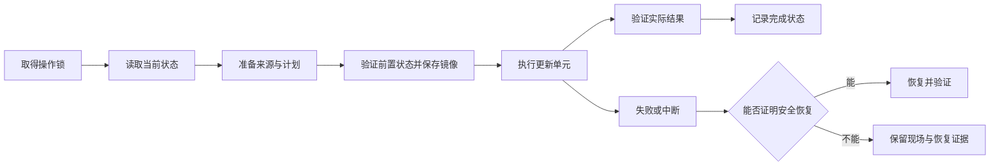

# 实现说明

skillctl 使用一个 Go 进程和本地 TOML/JSON 文件。既有 Provider 继续拥有安装与原生元数据，新安装由 skillctl 维护共享内容与 Agent 使用关系。

## 模块与状态

| 目录 / 入口 | 职责 |
|---|---|
| `main.go` | 进程入口、版本注入与中断取消；保留 `go build .` 和现有安装方式 |
| `internal/app/` | 清单与来源归属、生命周期计划、Provider 操作、事务恢复和命令编排；对外只提供 `Run` |
| `internal/cli/` | 参数解析、参数组合校验、命令帮助与 Agent 名称别名 |
| `internal/gitstore/` | Git 来源缓存、缓存锁、远端同步和批量对象读取 |
| `internal/installhistory/` | 从结构化 JSONL 记录提取安装候选；不执行命令、不登记来源 |
| `internal/skilldoc/` | SKILL.md 的 YAML 解析、名称校验和元数据读取 |
| `internal/archive/` | ZIP、tar.gz、单文件制品校验与展开限制 |
| `internal/fsutil/` | 跨平台路径身份、内容摘要、复制、文件替换和内核锁 |

依赖从 `main` 指向 `app`，再由 `app` 使用各职责包；职责包不反向依赖 `app`。涉及安装状态与事务的一致性规则仍集中在 `app`，避免把内部可变状态暴露给多个包。参数、文档、归档、缓存和文件操作的独立测试放在对应目录，跨模块的命令与生命周期测试放在 `internal/app/`。

本机状态位于 `SKILLCTL_HOME` 或系统用户配置目录下的 `skillctl`：

- `config.toml`：本机发现范围，仅 `config init` 显式初始化。
- `inventory.json`：共享内容版本、基线、所有 Agent 绑定及环境归属。
- `sources.json`：兼容既有复制安装来源与 Provider 基线。
- `store/<source-id>/<digest>/`：Agent 扫描目录外的内容版本。
- `disabled/`：原地目录停用时保留的快照。
- `hosts/`：已验证的宿主清单与观察基线。
- `profiles/`：本机激活 profile。
- `history/<UUID>/operation.json` 与 `before/`、`after/`：持久事务记录及镜像。

Git 来源缓存沿用系统用户缓存目录。项目中的 `skillctl.toml` / `skillctl.lock` 可共享，不包含本机绝对来源地址或 URL 凭据；本机 inventory/history 可以记录实际路径。

## 身份与发现

来源身份由 kind、来源地址、来源内路径和 ref 组成；目录副本另有 contentId。共享物理内容只描述一次，但保留每个 Agent/scope/project/path 的绑定。路径比较解析已存在的父目录别名，并保留叶子链接的独立身份，避免 macOS `/var` 别名以及多个 Agent 链接造成误合并。

无效 SKILL.md、不可读目录和断链保留为诊断项。v1 按原契约合并同名报告，同时保留 installations；v2 不按显示名称合并资产。

插件发现读取安装记录指定的版本，不从最大 cache 版本号推断安装状态。Codex 的本地列表可能使用上次原生查询的缓存，并明确标注；Claude 按 user/project/local 的安装和启用记录识别包。宿主未提供的操作通过 capabilities 显式拒绝。

## 执行与恢复

文件事务以真实修改路径为单位，拒绝重叠目标和包含事务日志的目标。每一步持久记录状态，执行前再次验证内容，使用同目录 stage/backup 和 rename 完成替换。事务指纹包含字节、模式与链接目标；来源内容摘要沿用跨平台文本换行规范化规则。回退前再次验证现场与备份，不覆盖后续编辑。

复制安装的更新将内容和来源记录放入同一事务。Git 原地更新记录整个仓库；linked worktree 另记录必要 gitdir 与分支引用。Vercel/well-known/GitHub CLI 仍执行原生更新，既有结果校验和失败恢复之外，新增持久 before/after 证据。外部命令被中断时，无法确定来源的新字节不会被当成可自动回滚的状态。

插件通过宿主接口执行和验证，不用文件覆盖改变宿主管理权。启停支持原生逆操作；没有精确版本恢复接口的更新/移除会报告回退不支持。已安装状态或 CLI 受理本身不足以代表验证完成。

检查可保存验证过的证据；预览使用只读来源状态，Git 仓库预览使用临时 bare clone，不修改安装仓库的 FETCH_HEAD 或 remote refs。只读列表和诊断不会初始化本机配置。

## 检查性能与缓存锁

自动来源恢复先按来源、ref 和缓存模式合并候选，再沿用最多 4 路的来源同步。一次恢复会话内，同一来源的成功结果或失败结果都会复用；20 个未知 Skill 共享一个安装记录时，只进行一次来源同步。候选仍须逐项通过内容验证，不能用缓存命中代替来源证明。

恢复会话为每个来源工作区建立一次名称到 Skill 路径的索引，保留重名歧义和缺失路径诊断。索引只在本次命令内复用；每个候选仍检查名称、目录边界及实际内容。安装历史按行复用读取缓冲区，超长记录继续完整解析，不增加持久历史缓存。优化取舍与逐项消融见 [性能实验](performance.md)。

Git 缓存使用非阻塞内核锁，等待时服从当前操作的取消与超时。进程退出后锁自动释放，不再依赖 30 分钟的文件过期时间。锁文件保留以维持同一个 inode；文件存在不表示仍被占用。遇到旧格式的 PID 标记，仍活动的旧进程受到保护，已退出的旧进程留下的标记会在取得锁后迁移。

`check/update` 会显示安装历史恢复阶段、来源数及同步结果；同一来源失败时合并受影响的 Skill 名称。网络请求本身仍可能超时；`--timeout` 是每个来源操作的预算，不是整条命令的总时限。

## 验证边界

自动测试覆盖文件事务的实际进程退出、部分执行、后续编辑、恢复失败保留证据、多个 Agent 的完整生命周期、profile 使用关系、来源切换、两个隔离环境的 frozen/offline 复现、错误摘要与归档路径。

Git 测试使用真实临时本地仓库。Codex/Claude、Vercel 与 GitHub CLI 的外部动作使用可控适配器 fixture 验证范围和读后校验，不代表已更新真实用户插件。Windows junction 由 Windows CI 的集成测试执行；本机跨平台编译只验证构建。

外部 CLI 并非与 skillctl 共享内核锁。执行前、备份后和执行后校验能够发现许多并发变更；无法证明归属的外部中断会保留证据并要求处理，不承诺跨进程或断电场景的分布式原子性。

宿主兼容目录依据 [Codex](https://learn.chatgpt.com/docs/build-skills)、[Cursor](https://prod.cursor.com/help/customization/skills)、[Copilot](https://docs.github.com/en/copilot/concepts/agents/about-agent-skills)、[Gemini CLI](https://geminicli.com/docs/cli/using-agent-skills/) 与 [OpenCode](https://opencode.ai/docs/skills) 的官方发现规则（2026-09-07 核对）。共享目录记录全部已知消费者；显式自定义 discovery 配置保持用户定义的范围。bindings 表示目录暴露与插件启用状态，宿主会话内禁用、权限规则和同名优先级仍由宿主决定。
